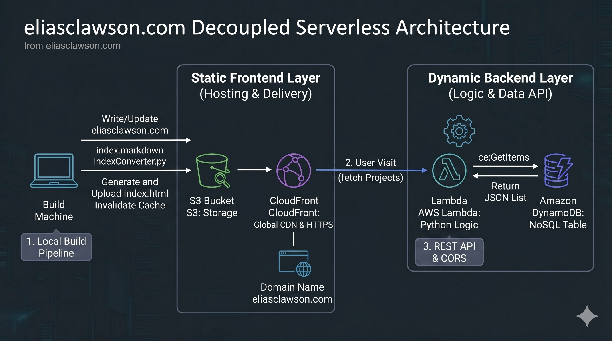

# Serverless Portfolio Website Architecture

This repository contains the infrastructure and code for a decoupled, cloud-native portfolio website. The project utilizes a serverless backend to dynamically manage project data while serving a high-performance, secure frontend via a global CDN.

## Core Architecture

The system is designed for high availability and minimal operational overhead using **Infrastructure as Code (Terraform)** to manage the following components:

### Frontend Layer (Hosting & Delivery)
* **Storage**: Amazon S3 stores static assets, including the generated `index.html` and CSS.
* **Global Distribution**: Amazon CloudFront serves as the entry point, providing HTTPS termination via AWS Certificate Manager (ACM) and edge-caching for low-latency delivery at **eliasclawson.com**.
* **Security**: S3 public access is strictly blocked; CloudFront accesses the bucket exclusively through an **Origin Access Control (OAC)**.

### Logic & Data Layer (Backend API)
* **Compute**: An AWS Lambda function (Python 3.12) serves as the REST API to retrieve project data.
* **Data Store**: Amazon DynamoDB maintains a NoSQL table (`PortfolioProjects`) containing project titles, descriptions, and GitHub links.
* **Integration**: The frontend uses asynchronous JavaScript (`fetch`) to communicate with a Lambda Function URL, with custom **CORS** handling implemented in Python.

## Automation & Build Pipeline

The project features a local build pipeline to streamline content updates and eliminate manual HTML overhead:
* **Markdown Conversion**: A Python script (`indexConverter.py`) parses `index.markdown` into HTML.
* **Template Injection**: The build script injects the specific Lambda API URL and dynamic content into a professional dark-mode template.
* **Cache Invalidation**: Automated workflow to clear the CloudFront edge cache upon new content uploads.

## Technical Implementation Details

* **Runtime**: Python 3.12 for both the build pipeline and the backend API.
* **Infrastructure**: Fully managed via Terraform, utilizing IAM roles for least-privilege access.
* **Networking**: Implements HTTPS redirection and restricted S3 bucket policies to ensure data integrity.

## Repository Structure

* `main.tf`: Terraform configuration for all AWS resources.
* `get_projects.py`: Lambda function logic to scan DynamoDB and return project JSON.
* `indexConverter.py`: Local build engine for converting Markdown to production-ready HTML.
* `index.markdown`: The source file for all site text and professional bio.
